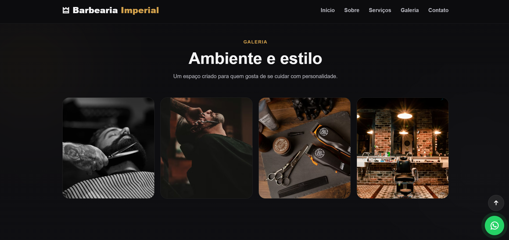

# Barbearia Imperial

Landing page desenvolvida com **HTML, CSS e JavaScript** para representar uma barbearia com identidade visual moderna, elegante e responsiva, com foco em apresentação de serviços, presença visual da marca e contato rápido com o cliente.

Este projeto foi criado com o objetivo de simular um site real para um negócio local, explorando uma proposta visual mais profissional e comercial. A estrutura da página foi pensada para destacar os principais serviços da barbearia, apresentar o ambiente, reforçar a identidade visual do negócio e conduzir o usuário para a ação principal da interface, que é o contato e o agendamento.

A proposta do layout foi unir estética moderna, clareza visual e experiência responsiva, aproximando o projeto de uma landing page profissional utilizada por clientes reais. Além do visual, o projeto também foi desenvolvido para fortalecer habilidades em organização de seções, hierarquia de informação, refinamento de interface e criação de páginas com foco em conversão.

## Preview


[Ver projeto online](https://seu-link-aqui.com)

## Funcionalidades

- Hero section com destaque visual
- Apresentação institucional da barbearia
- Seção de serviços
- Galeria de imagens
- Botão de contato via WhatsApp
- Menu responsivo para dispositivos móveis
- Botão de voltar ao topo
- Microinterações e efeitos de hover
- Animações suaves ao rolar a página
- Layout responsivo para desktop e mobile

## Tecnologias utilizadas

- **HTML5**
- **CSS3**
- **JavaScript**
- **Font Awesome**

## Mais imagens

**Galeria**


## Clone esse repositório ##
```bash
git clone https://github.com/Dexart2026/Dexart2026-Dex-land-page.git
```
## Estrutura do projeto

```text
barbearia-imperial/
├── index.html
├── style.css
├── script.js
└── imagens/

